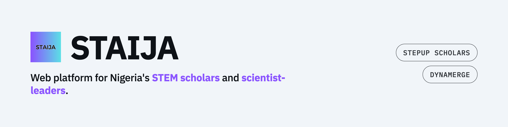
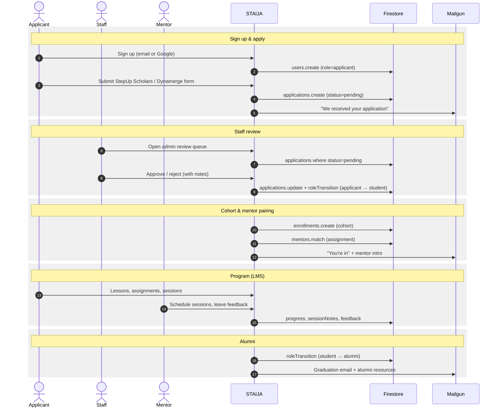

<picture>
  <source media="(prefers-color-scheme: dark)" srcset="tools/banner/banner-dark.png">
  
</picture>

[](https://staija.org)
[](https://vuejs.org)
[](https://www.typescriptlang.org)
[](https://firebase.google.com)
[](https://tailwindcss.com)
[](https://vitejs.dev)
[](#license)

# STAIJA

Web platform for STAIJA's StepUp Scholars and Dynamerge programs — application management, applicant tracking, mentorship, and public content for STEM students across Nigeria.

## How it works

The applicant → student → alumni loop, end-to-end:



Side flows (donations via Paystack, newsletter via Mailgun, CMS content from Contentful → Firestore via webhook) feed the same Firestore + Functions backbone.

## Demos

Recordings of the [E2E demo suite](./e2e) — generated by `npm run demo`, single-worker headless Playwright with `slowMo: 1200` so each beat is readable at 1×.

<details>
<summary><b>Public site tour</b> — homepage → programs → about → get involved → contact</summary>

<video src="e2e/videos/public-site-tour-visitor-explores-the-staija-homepage-and-programs.mp4" controls></video>

</details>

## Stack

| Layer | Technology |
|---|---|
| Frontend | Vue 3 + Vite + TypeScript |
| Auth | Firebase Authentication (email/password, Google) |
| Database | Cloud Firestore |
| File storage | Firebase Storage |
| Backend logic | Firebase Cloud Functions (Node 22) |
| CMS | Contentful → mirrored to Firestore via webhook |
| Email | Mailgun (transactional + newsletters) |
| Payments | Paystack (donations) |
| Hosting | Vercel (frontend SPA) |

## Prerequisites

- Node 22+
- Firebase CLI: `npm install -g firebase-tools` then `firebase login`
- A Firebase project on the **Blaze** plan (required for Cloud Functions; see the infrastructure notes)

## Local development

```bash
# 1. Install frontend dependencies
npm install

# 2. Copy the env template and fill in your Firebase + Contentful keys
cp .env.example .env

# 3. Start the dev server (http://localhost:5190)
npm run dev
```

### Environment variables

All frontend config is injected at build time via `VITE_*` variables in `.env`:

```
VITE_FIREBASE_API_KEY
VITE_FIREBASE_AUTH_DOMAIN
VITE_FIREBASE_PROJECT_ID
VITE_FIREBASE_STORAGE_BUCKET
VITE_FIREBASE_PUBLIC_BUCKET
VITE_FIREBASE_MESSAGING_SENDER_ID
VITE_FIREBASE_APP_ID
VITE_FIREBASE_MEASUREMENT_ID

VITE_CONTENTFUL_SPACE_ID
VITE_CONTENTFUL_DELIVERY_TOKEN
VITE_CONTENTFUL_PREVIEW_TOKEN
CONTENTFUL_MANAGEMENT_TOKEN
VITE_CONTENTFUL_ENV_ID

VITE_PAYSTACK_PUBLIC_KEY
VITE_NEWSLETTER_ENDPOINT            # subscribeNewsletter Cloud Function URL
VITE_PUBLIC_MENTORS_ENDPOINT        # getPublicMentors Cloud Function URL (public mentor showcase)
VITE_REFERRER_NAME_ENDPOINT         # resolveReferrerName Cloud Function URL (personalised /stay-connected hero)
VITE_APP_URL

VITE_RECAPTCHA_ENTERPRISE_SITE_KEY  # Firebase App Check site key (public)
```

The three `*_ENDPOINT` vars are optional. Each surface degrades to a sensible
empty state when its endpoint is unset:

- `VITE_NEWSLETTER_ENDPOINT` unset → newsletter forms record intent locally and
  show a fake-success state (no real signup happens).
- `VITE_PUBLIC_MENTORS_ENDPOINT` unset → `/stay-connected`'s mentor showcase
  renders its "Mentor profiles coming soon" empty state.
- `VITE_REFERRER_NAME_ENDPOINT` unset → `/stay-connected` falls back to the
  generic hero copy even when `?ref=u-<uid>` is in the URL.

`.env` is gitignored. It is only read by the Vite build — Cloud Functions read secrets from Firebase Secret Manager, not from `.env`.

## Cloud Functions

Functions live in [`functions/`](./functions) with their own `package.json`.

```bash
cd functions && npm install
```

Secrets are stored in Firebase Secret Manager (not `.env`). Before first deploy:

```bash
echo -n "<value>" | firebase functions:secrets:set MAILGUN_API_KEY          --data-file -
echo -n "<value>" | firebase functions:secrets:set MAILGUN_DOMAIN           --data-file -
echo -n "<value>" | firebase functions:secrets:set MAILGUN_LIST_ADDRESS     --data-file -
echo -n "<value>" | firebase functions:secrets:set PAYSTACK_SECRET_KEY      --data-file -
echo -n "<value>" | firebase functions:secrets:set CONTENTFUL_WEBHOOK_SECRET --data-file -
echo -n "<value>" | firebase functions:secrets:set REFERENCE_TOKEN_SECRET   --data-file -
```

See the infrastructure notes for the full secret inventory, the Mailgun sandbox-vs-verified-domain setup, and cost notes.

## Tests

```bash
npm test             # vitest run (all tests, single pass)
npm run test:watch   # vitest in watch mode
```

Tests live in [`tests/`](./tests). Service-layer tests mock Firebase; component tests use `@vue/test-utils` with `happy-dom`.

## Build & deploy

```bash
# Build
npm run build

# Deploy frontend (Vercel picks this up automatically on push to main,
# or run manually)
vercel --prod

# Deploy Cloud Functions
firebase deploy --only functions

# Deploy Firestore rules + indexes and Storage rules
firebase deploy --only firestore,storage
```

## User roles

| Role | Who |
|---|---|
| `applicant` | Anyone who creates an account |
| `student` | Accepted and active program participants |
| `alumni` | Past participants |
| `mentor` | Assigned mentors |
| `staff` | STAIJA team (@staija.org email, verified) |
| `admin` | Full access |

## License

MIT — see [LICENSE](./LICENSE).
